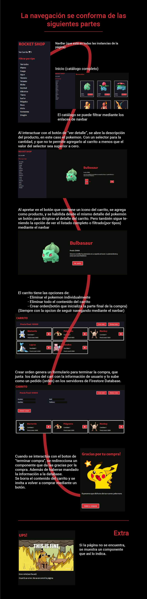

# PROYECTO REACT - MARTIN AGUIRRE

Hola!
Este sitio web es el proyecto que realicé en la cursada de React de CODERHOUSE.  
Se trata de un e-commerce basado en la saga de pokemon.

## 🚀 About Me
Estoy estudiando desarrollo web full stack.  
Con este curso de React JS, termino la parte de front-end de la carrera de CODERHOUSE. Y a partir de ahora voy a estar estudiando back-end (con fecha esperada de finalizacón aproximadamente en abril de 2023)  

Aparte de eso, estoy inscripto y cursando el programa del gobierno de la República Argentina llamado #SeProgramar, que consta de dos partes.  

Te dejo mi  [LinkedIn](https://www.linkedin.com/in/martin-aguirre-a9a047198/), y mi [mail](jmartinaguirre79@gmail.com).

## Ver sitio en vivo

#### Subido mediante netlify
https://app.netlify.com/sites/soft-speculoos-1a776b/deploys

## Descripción
A continuación se dará una breve descripción sobre la usabilidad del sitio.

## Descripción
A continuación se dará una breve descripción sobre la usabilidad del sitio.

## Tecnologías
Se usó React para la mayor parte del proyecto.  
Firebase de google para el manejo de productos.
Firestore Database para guardar los productos y pedidos.  
npm para el manejo e instalación de paquetes.  
Sass para definir los estilos. FontAwesome para satisfacer la necesidad de los iconos.  

## Documentation
[React](https://reactjs.org/)  
[React-dom](https://reactjs.org/docs/react-dom.html)  
[Firebase](https://firebase.google.com/docs?authuser=0&hl=es)  
[fontawesome](https://fontawesome.com/docs/apis/javascript/get-started)  
[npm](https://docs.npmjs.com/)

## Gracias!

Gracias por tomarte el tiempo de ver mi proyecto.  
Espero que te haya gustado. Cualquier consulta tenés mi linkedin y mail
¡Que tengas un lindo día!  

[LinkedIn](https://www.linkedin.com/in/martin-aguirre-a9a047198/)  
jmartinaguirre79@gmail.com
